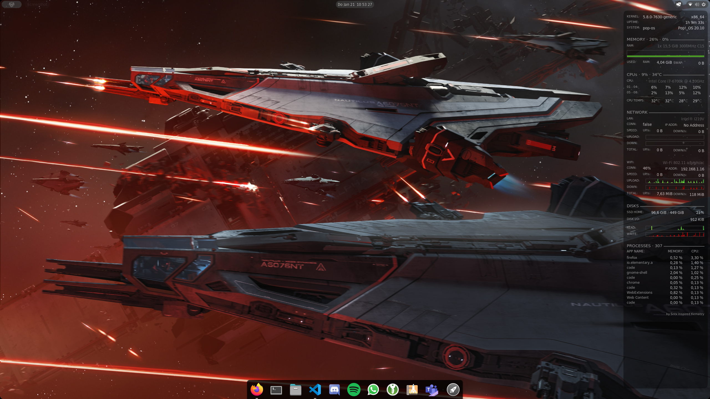

# my-popOS



## Distro

- [Pop!_OS 20.10](https://pop.system76.com/)

  - Set display timeout

  - Disable Mouse Acceleration

  - Set Terminal Transparency

  - Alias sudo as please with:

    ```bash
    echo please="sudo" >> ~/.bash_aliases
    source ~/.bashrc
    ```

## Software

- Conky @ `sudo apt install conky-all`

  - Install and setup [sensors](https://wiki.ubuntuusers.de/Lm_sensors/) with:

    - `sudo apt install lm-sensors`

    - `sudo sensors-detect`

  - Copy `conky/draw_bg.lua` to `~/scripts/draw_bg.lua`

  - Copy `conky/.conkyrc` to your home folder

  - Add conky to autostart

- [Discord](https://discord.com/download)

  - Add toggle mute keybind

- Firefox (already installed!)

  - Add [userChrome](https://www.userchrome.org/how-create-userchrome-css.html) containing:

    ```css
    #webrtcIndicator {
        display: none;
    }
    ```

- Htop @ `sudo apt install htop`

- KeePassXC @Pop!_Shop (flatpak)

- Neofetch @ `sudo apt install neofetch`

- [Parsec](https://parsecgaming.com/downloads/)

- PulseAudio Volume Control @ Pop!_Shop (flatpak)

- Spotify @ Pop!_Shop (flatpack)

- Tweak Tool @ Pop!_Shop (debian)

  - Top Bar enable `Weekday`, `Date`, `Seconds` & `Week Numbers`

  - Window Titlebars enable `Maximize` & `Minimize`

- Visual Studio Code @ Pop!_Shop (debian)

- "Youp for WhatsApp"

  - Add your WhatsApp Icon to `/home/<user>/Pictures/Icons/static/WhatsApp.svg`

  - Replace `~/.local/share/flatpak/exports/share/applications/com.gigitux.youp.desktop` contents with:

    ```txt
    [Desktop Entry]
    Name=Youp for Whatsapp
    Comment=A wrapper for whatsapp written in Rust
    Type=Application
    Exec=/usr/bin/flatpak run --branch=stable --arch=x86_64 --command=youp com.gigitux.youp
    Terminal=false
    Categories=Utility;GTK;
    Keywords=Rust;Flatpak;GTK;
    Icon=/home/<user>/Pictures/Icons/static/WhatsApp.svg
    StartupNotify=false
    X-Flatpak=com.gigitux.youp
    ```

    (Be sure to replace `<user>` with your accountname)

## Gnome Extensions

- [User Theme](https://extensions.gnome.org/extension/19/user-themes/)

- [Hide Top Bar](https://extensions.gnome.org/extension/545/hide-top-bar/)

- [Dash to Dock](https://extensions.gnome.org/extension/307/dash-to-dock/)

  - Dock Order (or already through screenshot?)

- [Rounded Corners](https://extensions.gnome.org/extension/1514/rounded-corners/)

- [Tweals in System Menu](https://extensions.gnome.org/extension/1653/tweaks-in-system-menu/)

- [Alt-Tab]( https://extensions.gnome.org/extension/15/alternatetab/)

## Appearance

- [Background (Star Citizen Aegis Nautlis Concept Art)](https://starcitizen.tools/images/6/68/Nautilus_-_In_formation_attacking_in_battle_-_Port.jpg)

- [Shell Theme: mcOS11 Theme](https://www.gnome-look.org/p/1220826/)

  - Extract into ~/.themes/

  - Copy both images from `images/theme` to `~/.themes/mcOS11-Shell-Dark/gnome-shell/assets`

## Other

- [Sennheiser-gsx-1200 driver](https://github.com/evilphish/sennheiser-gsx-1000)

## Old (DO NOT INSTALL)

// Needs to work with current OS version: [Komorebi](https://github.com/cheesecakeufo/komorebi/releases)

// Using Pop!_OS Dark instead of: [GTK Theme: WhiteSur GTK Theme](https://www.pling.com/p/1403328/)

// Not required after switching back to dark theme: [Spicetify-cli](https://github.com/khanhas/spicetify-cli/wiki/Installation) & [Spicetify Themes](https://github.com/morpheusthewhite/spicetify-themes)
